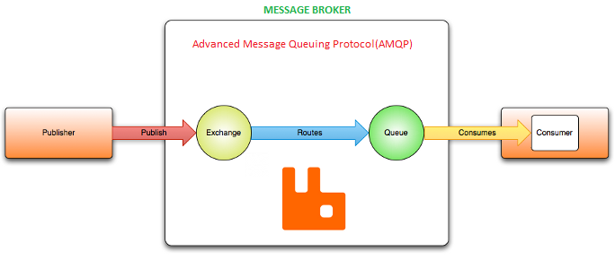
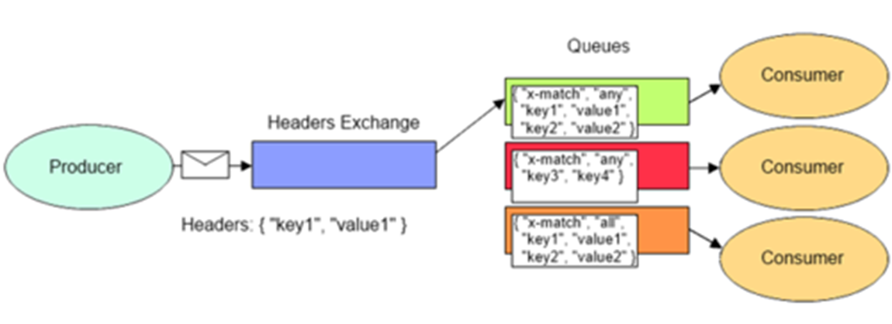
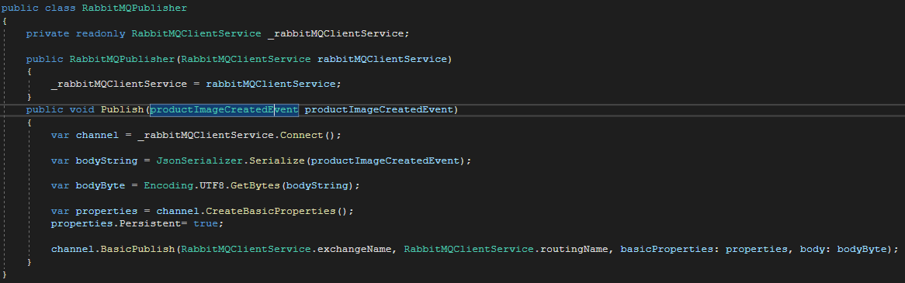
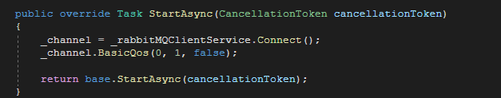

# RabbitMQ.Watermark

In this project, the use of rabbitmq with .net core is simulated on the scenario of adding watermarks to the images.
Before I start to explain the project, I would like to briefly talk about what rabbit MQ is used for and how it works.

As can be seen in the figure above, there are two main elements on the basis of RabbitMQ, namely Publisher and Consumer, as well as Exchange and Queue instruments. Here, Publisher is the application that sends a message to the queue, in other words, generates a message. After the Publisher publishes the message, Exchange will receive the relevant message.
Exchange forwards the message about the specified route to the queue. How the relevant message will go to the queue is learned from the route parameter in Exchange. Then the queued messages are sorted in the Queue. Queue is essentially a data structure and has a first-in, first-out (FIFO) mechanism.

Another element in Rabbit MQ is the consumer. Consumer is the application that consumes the message produced and queued by the Producer. Since Consumer can be developed in any language, it is an application independent of the software language. In this whole process, RabbitMQ uses the AMQP (Advanced Message Queuing Protocol) protocol and carries out its activities over the relevant protocol.

After talking about the working logic of RabbitMQ in general, it's time to talk about the concept of exchange.The main purpose of the exchange concept in rabbitMQ is to determine how the message produced by the producer will be forwarded to the queues that consumers subscribe to. Exchanges take a message and route it into zero or more queues. There are 4 exchange types in RabbitMQ: Direct, Fanout, Topic and Headers.

The first of these, Fanout Exchange, forwards the message to all the queues that consumers subscribe to, regardless of any parameters. In other words, when a new message is published by the producer, if the type of exchange receiving this message is fanout, it transmits a copy of this message to all queues.
The following image will help to understand this issue.

Another type of exchange that is used frequently and that I use in this project is Direct Exchange.In this type of exchange, the messages produced by the publisher are forwarded to the corresponding queues depending on a certain parameter (routing key). This excahnge type is used when different operations are requested with the published message. For example, let's assume that we want to inform users who use an application and we have 2 options to inform users. One of these options is to send an SMS to users' phones and the other is to send an e-mail. 

In such a scenario, 2 separate consumer applications can be created to send sms and mail, and then using direct excange, the same message can be sent to the queues to which these consumers are subscribed via different routing keys, and the process will be faster since the same application does not do 2 different jobs at the same time.
In the image below, we can observe how direct exchange behaves.

Since we have also mentioned the working logic of direct exchange, there is topic excange next.
The topic exchange is logically similar to direct exchange since it forwards the message to the wells depending on a routing key. However, there are some fundamental differences.The most important difference from direct exchange is that topic exchange allows the use of wildcards in the routing key. Topic exchange route messages to queues based on the wildcard match between routing key and routing pattern specified during the binding of the queue. Producer adds routing key in message header and sends it to topic exchange. After receiving a message, exchange try to match the routing key with the binding routing pattern of all the queues bound to it. If match is found, it route the message to the queue whose routing pattern is matched and if match is not found, it ignored the message.
also topic exchange allows the use of some specific characters. Unlike direct exchange, this type of exchange can also be used instead of other exchanges.For example When special characters “*” (star) and “#” (hash) aren’t used in bindings, the topic exchange will behave just like a direct one and When a queue is bound with “#” (hash) binding key – it will receive all the messages, regardless of the routing key like in fanout exchange.
however, it is not recommended to use topic exchange as a fanout exchange. 
In summary, topic exchange allows the message to be delivered to queues in a more specialized way.
The scenario in the image below can be given as an example of topic exchange which I took from rabbitMQ's own documentation.

In this example, we're going to send messages which all describe animals. The messages will be sent with a routing key that consists of three words (two dots). The first word in the routing key will describe a celerity, second a colour and third a species: "<celerity>.<colour>.<species>".

We created three bindings: Q1 is bound with binding key "*.orange.*" and Q2 with "*.*.rabbit" and "lazy.#".

These bindings can be summarised as:

Q1 is interested in all the orange animals.
Q2 wants to hear everything about rabbits, and everything about lazy animals.
A message with a routing key set to "quick.orange.rabbit" will be delivered to both queues. Message "lazy.orange.elephant" also will go to both of them. On the other hand "quick.orange.fox" will only go to the first queue, and "lazy.brown.fox" only to the second. "lazy.pink.rabbit" will be delivered to the second queue only once, even though it matches two bindings. "quick.brown.fox" doesn't match any binding so it will be discarded.

What happens if we break our contract and send a message with one or four words, like "orange" or "quick.orange.new.rabbit"? Well, these messages won't match any bindings and will be lost.

On the other hand "lazy.orange.new.rabbit", even though it has four words, will match the last binding and will be delivered to the second queue.
  
After mentioning this exchange type, we can switch to header exchange, which is the last exchange type that I don't mention.
Last exchange type is Headers Exchange We can say that Header Exchange is the version of Topic Exchange that I just mentioned, defined as key – value. In other words, it is an exchange type that creates the routing key value of the sent messages, not with a .(dot) as in the topic exchange, but with the value in the key - value format given in the header of the relevant message, and forwards it to the queues that match these keys.
  

After talking about all exchange types and the working logic of rabbit MQ, I start to introduce the project.
In this project, we will try to simulate adding watermarks to images using rabbit MQ. We will use an ASP.NET Web application as a producer, this web application will receive a picture from the user and publish it to the relevant queue. In the next step, the consumer will take the picture from the queue with the help of the relevant routing key, add a watermark and save the picture, and thus the process will be completed. As a consumer I created a background service, but this service can also be designed as a separate application if desired.
  
 The application to be used as a producer is a simple web application, so there are no details to be mentioned because the main purpose of the project is to understand the usage mechanism of rabbit MQ. The image below belongs to the created application.
 
  
I created a simple product class as a model. Since there is only one table in the database, I used an in memory database instead of using a relational database.I created a class called RabbitMQClientService that will establish the connection with rabbit MQ, define the exchange, create the queue and define the routing key required for direct exchange. I defined this class as a singleton on the DI Container side.I also used a logger to inform the user when the connection is established. DI Container does the creation of the instance of the ConnectionFactory class, which is required to create the connection, and I use the related instance with dependency injection. other than that, if there is already a channel, I return that channel, if not, I create a new channel and return it.
 
 
  
  
I defined the function that will enable the message to be published in RabbitMQPublisher. This class takes the class named RabbitMQClientService that I just introduced in its Constructor, and I get the channel information with the help of the connect method in this class. The Publish method takes an event as a parameter. This event is triggered after the image selected by the user is saved. In this event, I keep the name of the image as a string. After serailizing the name of the picture kept as a string in the event and turning it into a byte array, I publish it. I set the persistent parameter of the queue to true when publishing. Because if there is no consumer listening to the queue, I don't want the messages to be lost. The image below belongs to the RabbitMQPublisher class.
  
 

As seen below, in the Controller, I give a random name to the picture which I received from the user and save it, then I call the Publish method and thus the Publisher completes its task.
  
 
  
  After mentioning the publisher side, I can start to explain the consumer side. As I mentioned before, consumer was created as a background service.Fristly I create the necessary connection for the consumer to use in the StartAsync function, which will run when this service is up. Then I use the basic Qos function to determine how to distribute messages among consumers. This function has 3 parameters. These are prefetch size, prefetch count and global parameter. 
The prefetch size parameter represents the size of the message. If this parameter is set to 0 then it means that message size is not important. The second parameter, the prefetch count parameter, indicates how often the messages will be distributed among the consumers. If this value is greater than 1, while the consumer processes the first message, other messages are waiting in memory. If the last parameter, the global parameter, is true, it means that all consumers can consume messages at the same time as the value specified in the prefetchCount parameter. A value of false specifies how many messages each consumer receives and processes in a rendering time, independently of other consumers.The following code snippet belongs to the StartAsync function.
  
 
  
Then, within the executeasync function, the consumer performs the process of consuming the message in the queue. When Consumer receives the message, the Evnet named Consumer_Recieved is triggered. Also, in the ExecuteAsync function, I assigned a 20 second wait time for the relevant thread so that the consume process does not occur immediately.
  
 
  
  
In the ConsumerRecieved function, adding a water mark to the pictures is performed, and if this operation is successful, the consumer sends an acknowledge message that the process is completed, and thus the message is deleted from the queue.
  
 
  
 
In the screenshots I took from rabbit mq manager, you can see the messages in the queue, the defined exchange and the defined queue, respectively.
  
 
 
 
  
  
In the image below, you can see the picture sent as a message to the queue on the left, and the image with a watermark added by the consumer on the right.
 
 
  

  
  

  
